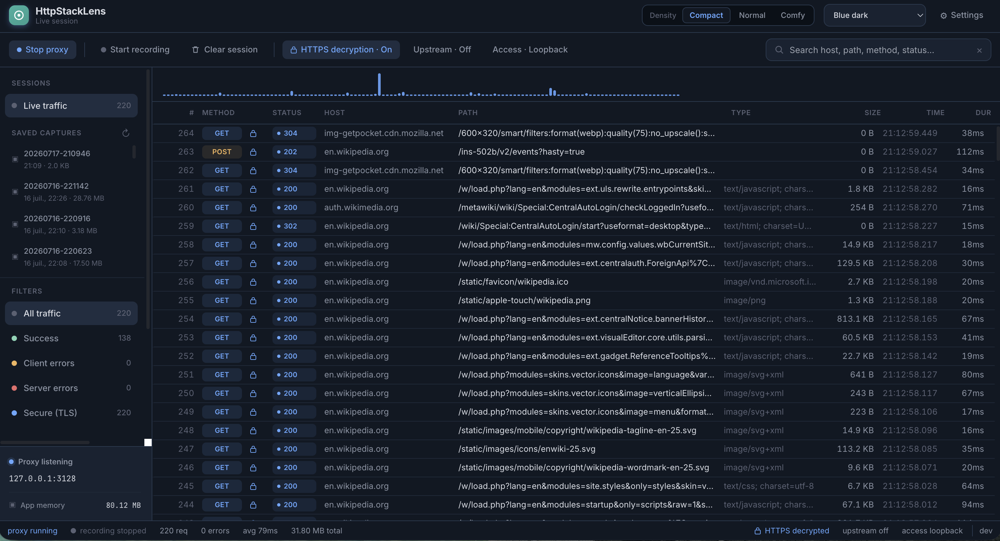

# HttpStackLens documentation website

A small static documentation site for HttpStackLens, ready for GitHub Pages.
No build step, no dependencies — plain HTML, one CSS file and one JS file.
Available in **English (root)** and **French (`fr/`)** with an in-page EN/FR switcher.

## Structure

```
Docs/website/
├── index.html                     # Home / overview            (English)
├── features.html                  # Every feature explained
├── getting-started.html           # Prerequisites, build & run
├── tutorial-upstream-proxy.html   # Tutorial 1 — replace PX behind a corporate proxy
├── tutorial-https-decrypt.html    # Tutorial 2 — debug HTTPS + clean up certificates
├── fr/                            # French translations (same 5 pages)
│   ├── index.html
│   ├── features.html
│   ├── getting-started.html
│   ├── tutorial-upstream-proxy.html
│   └── tutorial-https-decrypt.html
├── css/style.css                  # Theme-aware styles (light/dark, matches the app)
├── js/main.js                     # Theme toggle, mobile nav, copy buttons, EN/FR switch
├── assets/                        # Logo + diagrams (copied from the repo)
│   └── screenshots/               # 👉 drop your app screenshots here
└── .nojekyll                      # Serve as plain static files (skip Jekyll)
```

### Languages

The nav has an **EN / FR** switch. English pages live at the root and link to
`fr/<page>`; French pages live in `fr/` and link back with `../<page>`. Both
share the same `css/`, `js/` and `assets/`, so a screenshot added once shows up
in both languages. When adding or renaming a page, keep the two versions in sync
(same filename in the root and in `fr/`).

## Adding screenshots

The pages contain dashed **placeholder boxes** that name the file they expect,
e.g. `assets/screenshots/request-list.png`. To fill one in:

1. Save the screenshot into `assets/screenshots/` with that exact name.
2. Replace the placeholder block in the HTML:

   ```html
   <!-- from -->
   <div class="shot-placeholder">…</div>
   <!-- to -->
   
   ```

Suggested screenshots (filenames the pages already reference):

| File | Shows |
|---|---|
| `request-list.png` | The live request list |
| `decrypted-body.png` | A decrypted HTTPS response body |
| `split-panes.png` | Request/response split panes |
| `upstream-settings.png` | The upstream-proxy settings panel |
| `decrypt-toggle.png` | The HTTPS decryption toggle |
| `decrypted-inspect.png` | A decrypted request/response inspection |
| `cert-cleanup.png` | The certificate cleanup summary |

## Run the site locally

The site is plain static files, so you just need to serve the `Docs/website`
folder over HTTP and open it in a browser. **Serve it over HTTP — don't open the
`.html` files directly with `file://`**, or the shared `css/`, `js/` and the
EN/FR links won't all resolve correctly.

Pick whichever server you already have:

```sh
# From the website folder
cd Docs/website
```

**Python 3** (pre-installed on macOS/Linux):

```sh
python3 -m http.server 8000
```

**Node.js** (no install needed with npx):

```sh
npx serve -l 8000
# or:  npx http-server -p 8000
```

**PHP:**

```sh
php -S localhost:8000
```

Then open the site in your browser:

- English: <http://localhost:8000/>
- French:  <http://localhost:8000/fr/>

Use the **EN / FR** switch in the top-right of the nav to jump between languages,
and the 🌙 / ☀️ button to toggle light/dark. Edits to the HTML/CSS/JS show up on a
plain refresh — no build step. Stop the server with <kbd>Ctrl</kbd>+<kbd>C</kbd>.

> Tip: many editors can do this too — e.g. the **Live Server** extension in
> VS Code (right-click `index.html` → “Open with Live Server”), which also
> auto-reloads on save.

## Publish to GitHub Pages

Because the site lives in `Docs/website` (not the repo root or `/docs`),
publish it with a GitHub Actions workflow. Add
`.github/workflows/pages.yml`:

```yaml
name: Deploy docs to GitHub Pages
on:
  push:
    branches: [main]
    paths: ['Docs/website/**']
  workflow_dispatch:
permissions:
  contents: read
  pages: write
  id-token: write
concurrency:
  group: pages
  cancel-in-progress: true
jobs:
  deploy:
    runs-on: ubuntu-latest
    environment:
      name: github-pages
      url: ${{ steps.deployment.outputs.page_url }}
    steps:
      - uses: actions/checkout@v4
      - uses: actions/configure-pages@v5
      - uses: actions/upload-pages-artifact@v3
        with:
          path: Docs/website
      - id: deployment
        uses: actions/deploy-pages@v4
```

Then in **Settings → Pages**, set **Source** to **GitHub Actions**. The site
publishes at `https://<user>.github.io/<repo>/`.

> Alternatively, move this folder to `/docs` at the repo root and pick
> "Deploy from a branch → /docs" in Settings → Pages — no workflow needed.
