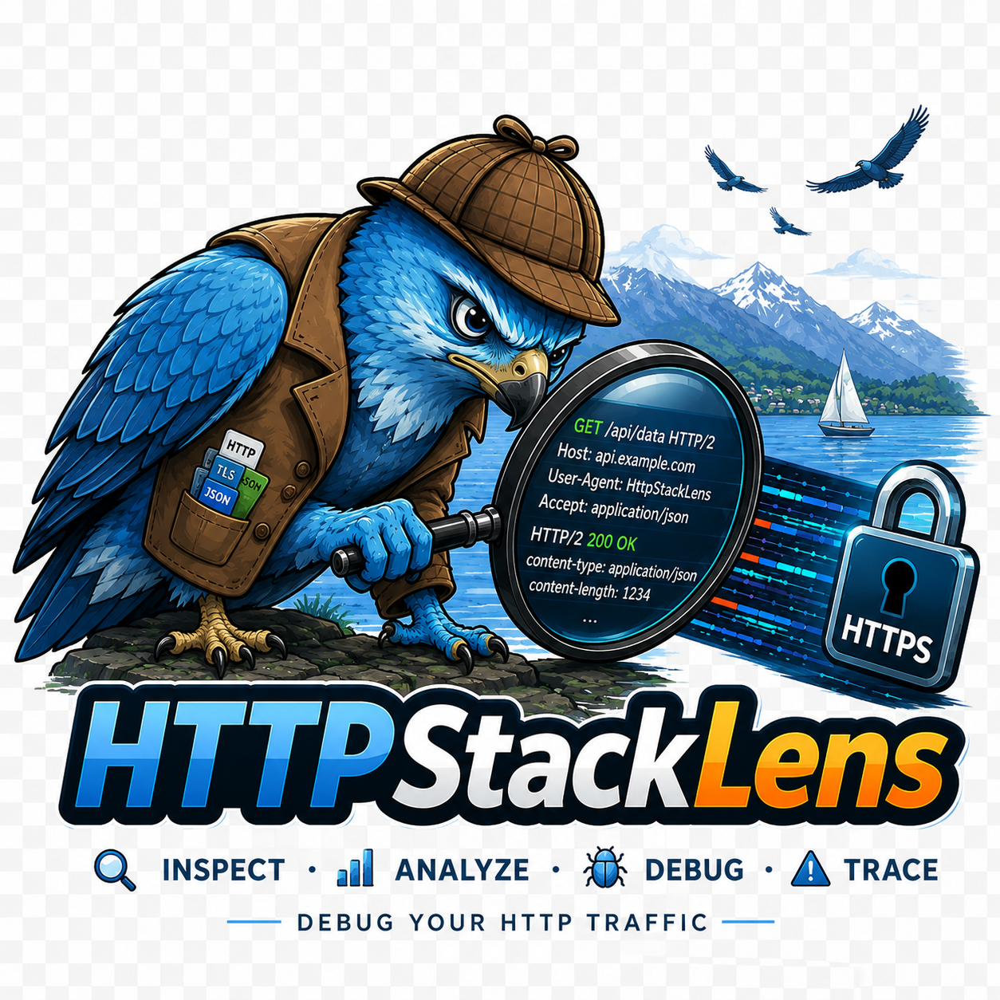

# HttpStackLens



[](https://github.com/rflechner/HttpStackLens/actions/workflows/release.yml)
[](https://github.com/rflechner/HttpStackLens/releases)
[](go.mod)
[](LICENSE)

> **Work in progress** — this project is far from finished and evolves over time.

HttpStackLens is a local HTTP/HTTPS proxy designed **for local development only**. It allows inspecting and visualizing HTTP traffic passing between a client and a server, acting as a minimal network debugging tool.

## Motivation

This project is primarily a **Go** learning exercise. The goal is to get familiar with the language and explore its idioms by comparing them with what I usually do in **C#** and **F#** — error handling, concurrency, code structure, etc.

## What it does (so far)

- Listens for incoming connections on a local port (default `3128`)
- Handles HTTPS tunnels via the `CONNECT` method
- Can decrypt HTTPS traffic with opt-in local MITM when `decrypt_https.enabled` is enabled
- Forwards requests and responses bidirectionally
- Wails desktop app with a Go/WASM traffic inspector

## What it doesn't do (yet)

- Not intended for production use or shared networks

## Prerequisites

- [Go](https://go.dev/dl/) 1.26.1 or later
- [Node.js](https://nodejs.org/) (for the Web UI build — Tailwind CSS)

## Build

A Go build tool in `build-tools/` handles the entire build pipeline (npm install, WASM compilation, CSS generation, native binary). **This is the recommended way to build the project.**

If you prefer to run each step manually, see [Manual steps](#manual-steps) below.

### Using the build tool

From the project root — **this is all you need:**

```sh
go run .\build-tools\main.go
```

Additional targets:

```sh
go run .\build-tools\main.go webui        # Web UI only (WASM + CSS)
go run .\build-tools\main.go app          # Standalone Wails app → build/bin
go run .\build-tools\main.go --help       # Usage
```

Release and cross-architecture builds can select an explicit Wails platform:

```sh
go run .\build-tools\main.go -platform windows/arm64 app
go run .\build-tools\main.go -platform darwin/amd64 app
```

The build tool is also the source of truth for Wails production tags, native
resources, the embedded WebView2 bootstrap on Windows, and version metadata.
Use `-skip-frontend` only when `webui/wwwroot` has already been built.

Or via npm scripts from `webui/`:

| Command | What it does |
|---|---|
| `npm run build` | Web UI + native binary |
| `npm run build:webui` | WASM + Tailwind CSS only |
| `npm run build:app` | Standalone Wails app in `build/bin/` |
| `npm run dev:css` | Tailwind CSS in watch mode (dev) |

The default target rebuilds the Web UI and creates a packaged desktop
application with the native window, icon and platform metadata:

```sh
go run .\build-tools\main.go
```

The standalone application is written to `build/bin/`. On Windows the WebView2
bootstrapper is embedded in the executable, so there are no frontend or runtime
sidecar files to distribute. The first build can download the pinned Wails CLI
when it is not already installed. Running
`go run -tags=dev .` remains useful during Go development and also opens the
Wails desktop window.

### JetBrains GoLand

Wails requires build tags; a standard GoLand configuration without tags starts
an error window instead of the application.

Create a **Go Build** configuration from **Run → Edit Configurations…** with:

| Field | Value |
|---|---|
| Name | `HttpStackLens` |
| Run kind | `Package` |
| Package path | `httpStackLens` |
| Working directory | the project root, for example `C:\dev\HttpStackLens` |
| Go tool arguments (Run) | `-tags=desktop,production` |
| Go tool arguments (Debug) | `-tags=dev` |
| Program arguments | empty, unless a proxy option is needed |

Use the `dev` tags when launching with the debugger. In this mode, static Web
UI files are read from `webui/wwwroot`, so HTML and JavaScript edits are visible
after a reload. Rebuild the generated WASM and CSS after changing the Go/WASM
frontend or Tailwind sources:

```powershell
go run .\build-tools\main.go webui
```

Then stop the previous application instance completely and launch it again from
GoLand. HttpStackLens uses a Wails single-instance lock, so an already running
window prevents a second instance from starting.

---

### Manual steps

<details>
<summary>Click to expand</summary>

#### 1. Install npm dependencies

```sh
cd webui
npm install
```

#### 2. Copy wasm_exec.js

```sh
# macOS / Linux
cp "$(go env GOROOT)/lib/wasm/wasm_exec.js" webui/wwwroot/js/wasm_exec.js

# Windows (PowerShell)
Copy-Item "$(go env GOROOT)\lib\wasm\wasm_exec.js" -Destination webui\wwwroot\js\wasm_exec.js
```

#### 3. Compile Go to WASM

```sh
# macOS / Linux
GOOS=js GOARCH=wasm go build -o webui/wwwroot/wasm/app.wasm ./webui/wasm

# Windows (PowerShell)
$env:GOOS = "js"; $env:GOARCH = "wasm"
go build -o webui\wwwroot\wasm\app.wasm .\webui\wasm
$env:GOOS = ""; $env:GOARCH = ""
```

#### 4. Build Tailwind CSS

```sh
cd webui
npx tailwindcss -i ./src/input.css -o ./wwwroot/css/output.css --minify
```

#### 5. Build the native binary

```sh
# macOS / Linux
go build -tags=desktop,production -ldflags="-s -w" -o httpStackLens .

# Windows
go build -tags=desktop,production -ldflags="-s -w -H windowsgui" -o httpStackLens.exe .
```

</details>

---

### Cross-compilation

Prefer the build tool so cross-architecture output receives the same Wails
production tags and native resources as a local release build:

**Windows ARM64:**

```powershell
go run .\build-tools\main.go -platform windows/arm64 app
```

**macOS Intel from an Apple Silicon runner:**

```sh
CGO_CFLAGS="-arch x86_64" CGO_LDFLAGS="-arch x86_64" \
  go run ./build-tools/main.go -platform darwin/amd64 app
```

Wails does not support cross-compiling a macOS app from Windows. The release
workflow therefore uses native Windows and macOS runners and only crosses the
CPU architecture where necessary.

### Windows-specific features

Two flags are available on Windows only (compiled in automatically when targeting `GOOS=windows`):

- `--windows-auth-require-ntlm` — require NTLM/Negotiate authentication from connecting clients
- `--output-proxy-add-windows-auth` — inject Windows credentials when forwarding to an upstream proxy

These rely on the Windows SSPI API (`secur32.dll`) and will return an error if used on other platforms.

## Usage

```sh
go run -tags=dev .
```

The Wails window opens automatically, and the proxy listens on `localhost:3128`.
You can test it with curl:

```sh
curl -x http://localhost:3128 http://example.com
```
